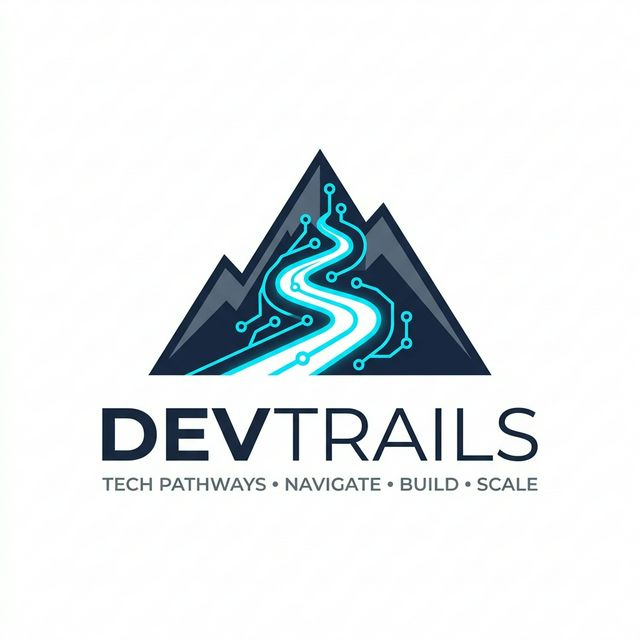

  

  # 🚀 DevTrails
  ### *AI-Powered Parametric Insurance Platform for Gig Delivery Workers*

  
  
  
  

  ---

  **Empowering the gig economy with real-time, automated income protection against environmental and operational disruptions.**

## 📖 1. Problem Context

Platform-based delivery workers form a critical layer of India’s digital economy. However, their income is highly sensitive to external disruptions such as **extreme weather**, **traffic congestion**, **pollution spikes**, and **local restrictions**.

These disruptions directly reduce active working hours, often leading to a **20–30% drop in daily earnings**. Currently, there is no structured mechanism to compensate workers for such losses. Existing insurance models are not designed for short-term, high-frequency income fluctuations.

---

## 💡 2. Proposed Solution

We propose a **parametric insurance platform** that provides **automated income protection** for gig delivery workers.

The system continuously monitors environmental and operational signals. When predefined disruption conditions are met, it:
*   ✅ **Identifies the event**
*   📉 **Estimates income loss**
*   💸 **Automatically triggers a payout**

*This eliminates the need for manual claim filing and reduces processing delays.*

---

## 🎯 3. Target Persona

**Segment:** Food Delivery Partners (Swiggy/Zomato) in urban environments.

| Attribute | Profile |
| :-- | :-- |
| **Working Hours** | 8–10 hours daily |
| **Daily Earnings** | ₹800–₹1200 |
| **Peak Windows** | Lunch (12–3 PM), Dinner (6–10 PM) |
| **Risk Exposure** | Weather, Traffic, Order Density |

> **Volatility Risk:** Short-duration disruptions during peak hours significantly impact earnings, making income volatility a major concern.

---

## ⚙️ 4. System Workflow

1.  **Session Start:** The worker logs into the mobile application and begins a delivery session.
2.  **Data Collection:** The system continuously collects:
    *   📍 Location and movement data.
    *   💰 Earnings data.
    *   ☁️ Environmental inputs (weather, traffic).
3.  **Real-time Processing:** Data is processed by the AI engine.
4.  **Trigger Evaluation:** A parametric trigger engine evaluates disruption conditions.
5.  **Automatic Payout:** If conditions are met:
    *   Income loss is estimated.
    *   Fraud checks are applied.
    *   Payout is initiated automatically.

---

## 📈 5. Weekly Pricing Model

The platform follows a weekly subscription model aligned with the earnings cycle of gig workers.

**Weekly Premium = Base Rate + Risk Adjustment**

| Zone Type | Risk Level | Weekly Premium |
| :--- | :---: | :---: |
| ✨ Low-risk | Low | **₹35** |
| ⚠️ Moderate-risk | Medium | **₹50** |
| 🚨 High-risk zones | High | **₹65** |

*Premiums are dynamically updated using risk prediction models based on historical data and real-time forecasts.*

---

## 🛠️ 6. Parametric Trigger Design

The system uses measurable conditions to detect disruptions. A payout is triggered only when multiple conditions are simultaneously satisfied:

*   🌧️ **Rainfall:** Threshold exceeds defined limits (e.g., >50 mm/hour).
*   📉 **Earnings:** Zone-level earnings drop significantly (e.g., >40%).
*   🐢 **Mobility:** Worker mobility falls below threshold (e.g., <2 km/h).
*   👥 **Consensus:** Multiple workers in the same zone exhibit similar patterns.

---

## 💵 7. Income Loss and Payout Logic

Income loss is estimated using a baseline comparison model.

*   **Expected Earnings:** Derived from historical averages under similar conditions.
*   **Actual Earnings:** Real-time observed earnings.

`Loss = Expected Earnings – Actual Earnings`
`Payout = Percentage of Loss (e.g., 70%)`

### 💡 Example:
*   Expected: **₹1000** | Actual: **₹400**
*   Loss: **₹600** ➡️ Payout: **₹420**

---

## 🤖 8. AI/ML Components

### 🧠 8.1 Risk Prediction Model
*   **Inputs:** Weather forecasts, zone characteristics, historical data.
*   **Output:** Risk score used in premium calculation.

### 🔍 8.2 Disruption Detection
*   **Approach:** Anomaly detection (e.g., Isolation Forest).
*   **Goal:** Detects abnormal drops in earnings and mobility.

### 🛡️ 8.3 Fraud Detection
*   **Features:** GPS consistency, Device identifiers, Cross-user validation.
*   **Output:** Fraud risk score before payout approval.

---

## 🛡️ 9. Fraud Prevention Strategy

The system adopts a multi-layer validation framework:
*   📡 **Signal Cross-Verification:** Earnings, mobility, and environment alignment.
*   🗺️ **Zone-Level Validation:** Events must impact multiple workers in the region.
*   📍 **GPS Integrity Checks:** Detection of spoofing or static anomalies.
*   👤 **Behavior Profiling:** Identification of historical pattern deviations.
*   📱 **Device Monitoring:** Prevention of multi-account misuse.

---

## 🏗️ 10. System Architecture Overview

The platform is structured into the following layers:
*   📱 **Mobile Application** (Data capture & Interaction)
*   🌐 **Backend Services** (API layer & Orchestration)
*   ⚡ **Data Processing Layer** (Real-time stream handling)
*   🤖 **AI Engine** (Risk, Disruption & Fraud models)
*   🎯 **Trigger Engine** (Parametric condition evaluation)
*   💳 **Payout Module** (Payment system integration)

---

## 📊 11. Dashboard Design

### 🧑‍💼 Worker Dashboard
*   Active coverage status.
*   Total earnings protected.
*   Claim and payout history.

### 🖥️ Admin Dashboard
*   Policy distribution & Claims statistics.
*   Fraud alerts & Zone-wise risk analytics.
*   Predictive insights for upcoming disruptions.

---

## 🔌 12. Integration Strategy

*   ⛅ **Weather APIs** for environmental monitoring.
*   🗺️ **Map Services** for mobility analysis.
*   🏦 **Bank/Payment APIs** for payout demonstration.
*   📂 **Payload Simulations** for earnings data.

---

## 💼 13. Business Model

*   **Premium Income:** Weekly subscriptions from workers.
*   **B2B Subsidies:** Platforms may optionally subsidize coverage for partners.
*   **Efficiency:** Automated processing reduces operational costs significantly.

---

## 🛣️ 14. Development Roadmap

- [x] Persona definition and workflow design
- [x] Parametric trigger modeling
- [/] AI model architecture design
- [ ] Backend and data schema setup
- [ ] Prototype development & Beta Testing

---

## 🏁 15. Conclusion

This platform introduces a **practical and scalable approach** to income protection for gig workers. By combining parametric insurance with real-time data and AI-driven validation, the system delivers immediate financial support while ensuring a sustainable and fraud-resistant insurance model.

---

  <h3>Developed with ❤️ by Team Logic Legends</h3>
  
  
  

